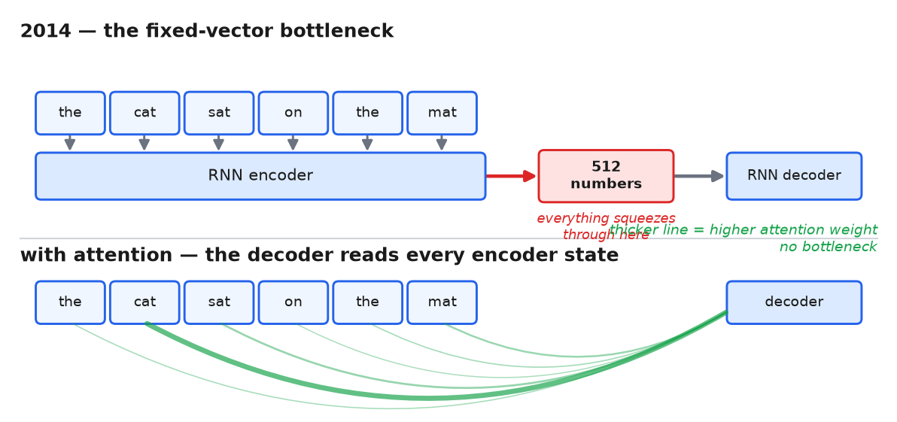
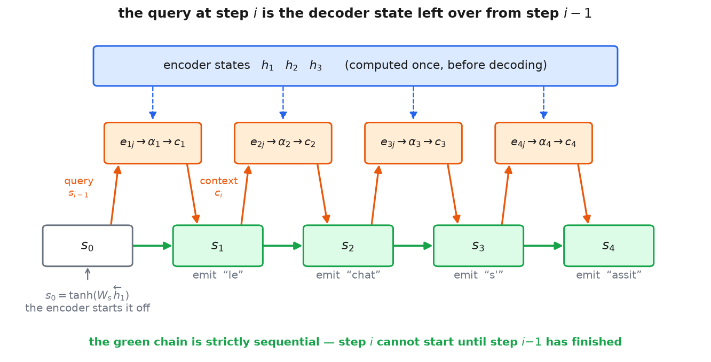

# 1 · The scoring function

*~6 min. Lesson 1, part 1 of 9.*

## The problem

Sequence-to-sequence models used to be a straight pipeline:

```
"the cat sat on the mat"  →  [RNN encoder]  →  [ one fixed vector ]  →  [RNN decoder]  →  "le chat..."
```

Spot it? A 4-word sentence and a 40-word sentence both get **the same one vector**. Everything
squeezes through it, and translation quality collapsed on long inputs.

The obvious fix is to stop squeezing: keep one vector per input word, and let the consumer pick
which ones it needs at each output step.

Which raises the actual question:

> **Given this position, which other positions should it pull information from?**

"Pick" isn't differentiable, so you can't learn it. What you *can* do is put a number on every
candidate — how relevant is this one to what I need right now — and blend by those numbers.

**That number is the score.** It's the whole of this lesson: how it's computed, how it becomes
weights, and how those weights mix information.



*(Bahdanau et al., 2014 — and note the recurrence stayed. This was an addition to the RNN, not
a replacement for it. **Origin tag: Fix** — named failure, targeted response.)*

---

## Where the score is computed

Running example: translate "the cat sat" → "le chat s'assit".

> $T_x$ — the **source** length, the number of input words. Here $T_x = 3$.
> $T_y$ — the **target** length, the number of output words. Here $T_y = 4$.
> Both vary per sentence; neither is a hyperparameter.

### The encoder runs once

It reads the source one word at a time, carrying a vector forward and updating it each step.
Keep that vector at every position instead of only the last one:

$$h_1,\; h_2,\; h_3$$

> $h_j \in \mathbb{R}^{d_h}$ — the encoder's state at source word $j$. One per source word, so
> $T_x$ of them. $d_h$ is the encoder's width.

Bahdanau read the sentence **twice** — once left-to-right, once right-to-left — and glued the
two halves together:

$$h_j \;=\; \left[\,\overrightarrow{h}_j \,;\, \overleftarrow{h}_j\,\right]$$

Each half is $d_h/2$ wide ($1000$ in the paper, so $d_h = 2000$). This matters twice below: it
means $h_j$ is not "the source up to word $j$" but the whole sentence *centred* on word $j$, and
it's where the decoder's first state comes from.

Keeping all $T_x$ of them instead of just $h_{T_x}$ **is** the fix. Everything below is about
choosing between them.

### Starting the decoder

The decoder is a second RNN, and an RNN needs a state to begin from. So what is the *first* one,
before anything has been generated?

$$s_0 \;=\; \tanh\!\left(W_s\, \overleftarrow{h}_1\right)$$

> $\overleftarrow{h}_1 \in \mathbb{R}^{d_h/2}$ — the **backward** encoder's state at position 1.
> The backward pass reads right-to-left, so by the time it reaches word 1 it has consumed the
> entire sentence. This is the one half-vector that has seen everything.
> $W_s \in \mathbb{R}^{d_s \times d_h/2}$ — a small **learned** matrix, trained with the rest.
> $d_s$ is the decoder's width, and it does **not** have to equal $d_h$ — here it's $1000$
> against $2000$. That inequality does real work in part 2.

So the first decoder state is a learned summary of the whole source: *"here's the sentence — what
should a translation of it start with?"* Nothing circular, nothing magic. Other implementations
pick differently — the mean of the $h_j$, or a learned constant vector that ignores the source
entirely — because this is a bootstrap detail, not a mechanism.

The decoder also needs a previous *word* to feed itself, and there isn't one, so a reserved token
$y_0 = \texttt{<sos>}$ ("start of sequence") is prepended to every target sentence during
training. The model learns an embedding for it like any other word.

**Worth noticing now:** this whole question only exists because there's a state chain to start.
The **transformer** — the architecture this lesson is building toward, assembled in part 4 — has
no such chain, so the problem evaporates: its first input is just the $\texttt{<sos>}$ embedding,
with no state to initialize at all.

### One decoder step

At step $i$ the decoder holds $s_{i-1}$ and does three things before emitting anything.

> $s_{i-1} \in \mathbb{R}^{d_s}$ — the decoder's state: a vector holding everything generated so
> far. The subscript is $i-1$ because when producing word $i$, the state you have is the one left
> over from word $i-1$. This is the thing doing the asking.

**1 · Score every candidate.**

$$e_{ij} \;=\; \mathrm{score}\!\left(s_{i-1},\, h_j\right) \qquad j = 1, \dots, T_x$$

> $e_{ij} \in \mathbb{R}$ — **one number.** How relevant source word $j$ is to what the decoder
> needs right now. Unbounded: it can be $-3.7$ or $12.0$.

The two arguments have names, and they're the names everything later is written in:

> **Query** — what the thing doing the looking is after. Here $s_{i-1}$, shape $(d_s,)$.
> *"I'm about to emit a French word; what do I need?"*
> **Key** — what a thing being looked at advertises about itself. Here $h_j$, shape $(d_h,)$.
> *"I'm the word 'cat', position 2."*

$\mathrm{score}$ stays a black box until part 2 — but note its *type* now, because it's easy to
misread the formula. It eats **one** query and **one** key and returns **one scalar**. No $T_x$
appears inside it. The $T_x$ comes from running it once per source position and collecting the
results into a vector $e_i \in \mathbb{R}^{T_x}$, here shape $(3,)$.

**These are the scores.**

**2 · Normalize into weights.** Scores can't multiply anything yet — scale all of them by $100$
and the blend below would grow $100\times$ while the *preferences* between source words stayed
identical. To be mixing proportions they have to be positive and sum to 1, which is what softmax
does:

$$\alpha_{ij} \;=\; \frac{\exp(e_{ij})}{\sum_{j'=1}^{T_x} \exp(e_{ij'})}$$

> $\alpha_{ij} \in [0,1]$ — the **weight** on source word $j$ at step $i$. $j'$ is a summation
> index running over **every** source position, which is exactly what forces
> $\sum_j \alpha_{ij} = 1$.

Score and weight are two different objects one step apart. (Everyone conflates them in
conversation — papers and library code both call $\alpha$ "attention scores". Ask which side of
the softmax they mean.)

Concretely $\alpha_i = [0.02,\ 0.95,\ 0.03]$: *while producing this French word, 95% of my
attention is on "cat".*

**3 · Blend.**

$$c_i \;=\; \sum_{j=1}^{T_x} \alpha_{ij}\, h_j$$

> $c_i \in \mathbb{R}^{d_h}$ — the **context vector**. A weighted average of the $h_j$, so it
> lands back in the same space they live in.

Then the state updates and a word comes out:

$$s_i \;=\; f\!\left(s_{i-1},\, y_{i-1},\, c_i\right)$$

> $f$ — the decoder's RNN cell. Three inputs: where it was, what it last said, what it just
> looked at.
> $y_{i-1}$ — the previous output word. During training this is the **ground-truth** previous
> word rather than the model's own guess, so one bad prediction doesn't derail the rest of the
> sentence. That's called **teacher forcing**, and it comes back in part 3.

Word $i$ is then predicted from $s_i$, $y_{i-1}$ and $c_i$ — instead of from one frozen vector.

### The loop, unrolled

Four output words, so four passes:

```
encoder runs once:    h₁  h₂  h₃

s₀ = tanh(W_s ←h₁)                                                   ← from the encoder
step 1:   e₁ⱼ = score(s₀, hⱼ)  →  α₁  →  c₁  →  s₁ = f(s₀, y₀, c₁)  →  emit "le"
step 2:   e₂ⱼ = score(s₁, hⱼ)  →  α₂  →  c₂  →  s₂ = f(s₁, y₁, c₂)  →  emit "chat"
step 3:   e₃ⱼ = score(s₂, hⱼ)  →  α₃  →  c₃  →  s₃ = f(s₂, y₂, c₃)  →  emit "s'"
step 4:   e₄ⱼ = score(s₃, hⱼ)  →  α₄  →  c₄  →  s₄ = f(s₃, y₃, c₄)  →  emit "assit"
```



There's no chicken-and-egg. At step $i$ you attend with a state you **already finished
computing** at step $i-1$ — *"given everything I've generated so far, what do I need next?"* —
and "everything so far" genuinely is already sitting there.

But follow the state chain across the steps above — drawn in green in the figure — and notice
what it costs:

$$s_1 \;\to\; c_2 \;\to\; s_2 \;\to\; c_3 \;\to\; s_3$$

You cannot compute $c_2$ before $s_1$ exists, and $s_1$ needs $c_1$. **The decoder cannot be
parallelized over $i$** — not at training time, not at inference. That's structural, and it's
part 3's whole subject.

### Where scores live, and how long

Inside the decoder loop, rebuilt every step, once per source position. Step $i$ builds a fresh
$e_i$ of shape $(T_x,)$; with $T_y = 4$ output words that's four of them — a
$T_y \times T_x = 4 \times 3$ table over the whole translation.

Watch the lifetime: built → softmaxed into $\alpha$ → used to weight the $h_j$ → **dropped**.
Scores are never stored, and they are not parameters — nothing in the optimizer's care. They're
recomputed from scratch for every sentence, like any activation. What training updates is the
*function* that produces them, never the scores themselves. That stays true for every attention
mechanism in this course.

---

## One vector, two jobs

Bind "key" to **the side being looked at**, not to "the encoder." That distinction looks
pedantic now, when the keys obviously are the encoder states — but part 5 builds attention where
both sides come from the same sequence, and "key = encoder" stops making sense there.

Now notice something about the two formulas above. $h_j$ appears **twice**:

$$e_{ij} = \mathrm{score}(s_{i-1},\, \underbrace{h_j}_{\text{step 1}}), \qquad\qquad
c_i = \sum_j \alpha_{ij}\, \underbrace{h_j}_{\text{step 3}}$$

One vector doing two different jobs: *how you get found*, and *what you contribute once found*.
There is no reason those have to be the same vector. Splitting them apart produces a third name
and a third projection — part 5.

---

## The chain so far

```
fixed-vector bottleneck
    → keep every encoder state
    → score each one against the decoder's current state, mix by weight
    → ??? — nobody has said how score() is actually computed
```

That last line is the whole of part 2, and the answer decides which of the two competing
attention designs is the one still running today.

**→ [2 · Additive or multiplicative](2-additive-or-multiplicative.md)**
