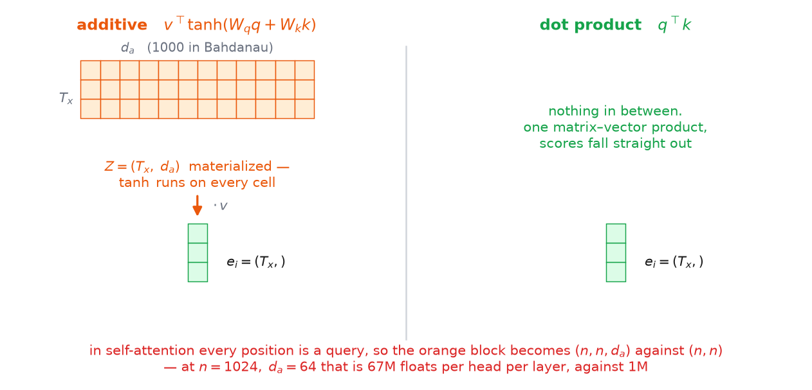

# 2 · Additive or multiplicative

*~6 min. Lesson 1, part 2 of 9.*

## The problem

Part 1 left a hole in the middle of the mechanism:

$$e_{ij} \;=\; \mathrm{score}\!\left(s_{i-1},\, h_j\right)$$

Everything downstream was specified — softmax it, blend the $h_j$ by it — but $\mathrm{score}$
itself was never opened up. It has a hard job: eat two vectors that don't even have to be the
same width ($d_s = 1000$ and $d_h = 2000$ in Bahdanau's setup) and return **one number** saying
how well they go together.

Two answers were proposed within a year of each other. One is more general. The other is the one
in every model you'll ever load, and the reason why is not "it worked better".

---

## Additive — a small neural network

$$\mathrm{score}(q, k) \;=\; v^{\top} \tanh\!\big(W\,[\,q;\,k\,]\big)$$

Read it right to left, one shape at a time. This is **one pair in, one scalar out** — the same
type as in part 1, so nothing here has a $T_x$ in it yet.

| Step | Shape | What it is |
|---|---|---|
| $q$ | $(d_s,)$ | the query — one decoder state $s_{i-1}$ |
| $k$ | $(d_h,)$ | the key — one encoder state $h_j$ |
| $[\,q;\,k\,]$ | $(d_s + d_h,)$ | concatenation: stack them end to end into one long vector |
| $W$ | $(d_a,\; d_s{+}d_h)$ | **learned** matrix |
| $W[\,q;\,k\,]$ | $(d_a,)$ | |
| $\tanh(\cdot)$ | $(d_a,)$ | elementwise — shape unchanged |
| $v$ | $(d_a,)$ | **learned** vector |
| $v^{\top}\tanh(\cdot)$ | $()$ | **scalar** — this is $e_{ij}$ |

> $d_a$ — the width of the hidden layer, a hyperparameter of the scoring function itself and
> nothing to do with $d_s$ or $d_h$. Bahdanau used $1000$.

So it's a one-hidden-layer MLP eating a (query, key) pair. $W$ and $v$ are its only parameters,
and they are shared across every step $i$, every source position $j$, and every sentence in the
dataset. One small network, reused everywhere.

### The concatenation is secretly two projections

This is the step that makes the shapes click. Split $W$ into its left and right halves —
$W = [\,W_q \mid W_k\,]$, with $W_q$ of shape $(d_a, d_s)$ and $W_k$ of shape $(d_a, d_h)$. Then

$$W\,[\,q;\,k\,] \;=\; W_q\,q \;+\; W_k\,k$$

Concatenate-then-multiply **is** multiply-separately-then-add; it's the same numbers grouped
differently. Bahdanau writes it the second way. So:

$$\mathrm{score}(q,k) \;=\; v^{\top}\tanh\!\left(W_q\,q + W_k\,k\right)$$

Now batching over the $T_x$ keys is obvious:

```python
K_proj = H @ W_k.T          # (T_x, d_h) @ (d_h, d_a)  ->  (T_x, d_a)
q_proj = W_q @ s_prev       # (d_a, d_s) @ (d_s,)      ->  (d_a,)
Z      = torch.tanh(q_proj + K_proj)    # broadcast     ->  (T_x, d_a)
e_i    = Z @ v              # (T_x, d_a) @ (d_a,)      ->  (T_x,)
```

Two things fall out of this that are worth keeping.

**`K_proj` doesn't depend on $i$.** The encoder states never change during decoding, so you
project the keys **once** before the loop starts and reuse them across all $T_y$ steps. That is
the direct ancestor of the KV cache in section 03 — same observation, same payoff.

**$q$ and $k$ never have to be the same width.** $W_q$ and $W_k$ only have to agree on their
*output* size $d_a$. Bahdanau leaned on this: a $1000$-wide decoder state scoring against
$2000$-wide bidirectional encoder states, no reshaping anywhere.

---

## Multiplicative — just a dot product

$$\mathrm{score}(q, k) \;=\; q^{\top} k \;=\; \sum_{m=1}^{d} q_m k_m$$

No parameters at all. No hidden layer, no $W$, no $v$. Batched over the keys it's one line:

```python
e_i = K @ q                 # (T_x, d) @ (d,)  ->  (T_x,)
```

Which should bother you. The additive form had a learned $W$ standing between the query and the
key, and that's where the "how do these two relate?" knowledge lived. Delete it and you're
asking two vectors, produced by two different networks doing two different jobs, to line up
under a plain sum of products. Why would they?

### Why it isn't absurd

**First, it doesn't even typecheck everywhere.** $\sum_m q_m k_m$ requires $q$ and $k$ to have
the same width. This is a hard architectural constraint, not a preference — and Bahdanau's model
**fails it**: bidirectional encoder states at $d_h = 2000$ against a decoder at $d_s = 1000$.
You cannot drop a dot product into his architecture at all.

Luong's is built differently: stacked LSTMs, $1000$ units on the encoder side *and* the decoder
side, and a decoder whose state chain is seeded from the encoder's final state. Same width by
design, shared origin. The two spaces aren't strangers.

**Second, the relation is still learned — by the RNNs.** Look at what a gradient step does:

$$\frac{\partial e_{ij}}{\partial q} \;=\; k, \qquad \frac{\partial e_{ij}}{\partial k} \;=\; q$$

Say the model should have attended to source word 2 and didn't. The loss pushes $e_{i2}$ up, and
the gradient's instruction is: **move the query toward $h_2$, and move $h_2$ toward the query.**
Those are directions in the state spaces themselves, so they flow straight back into the encoder
and decoder weights.

Across training, the two networks get shaped by one loss into a geometry where *relevant* means
*aligned*. The capacity to learn the relation didn't disappear when $W$ and $v$ were deleted —
it moved into the two RNNs, which were being trained anyway.

> You need a learned comparison function when you **can't change** the things being compared —
> frozen features, a pretrained encoder you don't own. When both sides are trainable, the
> comparison itself can be fixed.

### Luong wasn't sure either

He didn't propose the dot product as the answer. He proposed **three** scoring functions and
measured them:

| Name | Form | |
|---|---|---|
| dot | $q^{\top} k$ | no parameters |
| general | $q^{\top} W_a\, k$ | **a learned matrix between the two** |
| concat | $v_a^{\top}\tanh\!\big(W_a[\,q;k\,]\big)$ | Bahdanau's additive form |

The middle row is the obvious hedge against exactly the worry above: if the two spaces might not
line up, put a learned matrix in between. It was implemented and shipped as a peer of the other
two, and the results were mixed — no single form dominated across his settings.

That is the entire empirical basis. Nobody proved a bare inner product was sufficient; it
performed comparably and cost nothing, so it survived.

*(Luong et al., 2015. **Origin tag: Empirical / efficiency** — this was not fixing a failure.
The tidy explanation you'll hear today — "the dot product is the natural similarity measure" — is
a story attached to the result afterwards. Don't carry it as a derivation.)*

---

## Why the dot product won

It scored about as well, and it's much faster — but not for the reason usually given. Additive
attention batches over the keys perfectly well; the code above is one broadcast add. The
difference is in what each one has to **materialize** on the way to those $T_x$ numbers.



| | intermediate | then |
|---|---|---|
| additive | $Z$, shape $(T_x, d_a)$ | reduce to $(T_x,)$ |
| dot product | none | scores fall straight out |

With $d_a = 1000$, additive touches a thousand values for every one score it produces, and
$\tanh$ is elementwise work no matmul kernel can absorb into itself.

Then it gets much worse in exactly the direction this lesson is heading. In self-attention every
position is a query, so $T_y = T_x = n$ and that intermediate becomes $(n, n, d_a)$. At
$n = 1024$ and $d_a = 64$ that's 67M floats **for one head in one layer**, before anything has
been reduced. The dot product needs $(n, n)$: 1M. That's the difference between a mechanism you
can scale and one you can't.

The $\tanh$ sitting *between* $q$ and $k$ is what forces the extra dimension. It's also why
there's no matrix product to factor out of the additive form — the two vectors never meet as a
product at all.

**The technique that won is the one that maps onto the hardware, not the one with more
expressive power.** This pattern decides a lot of this roadmap; FlashAttention and GQA win the
same way, in section 03.

### What the dot product cost

Two things, and neither is nothing.

**Expressiveness.** $v^{\top}\tanh(W_q q + W_k k)$ is a *nonlinear* function of the pair.
$q^{\top}k$ is a sum of products. Additive can express interactions between query and key that
the dot product cannot reach at all. It lost on cost, not on quality — don't let the outcome
convince you it was also the better function.

**Scale.** With roughly independent, zero-mean, unit-variance components,

$$\mathrm{Var}\big(q^{\top}k\big) \;=\; \sum_{m=1}^{d}\mathrm{Var}(q_m k_m) \;=\; d$$

so the scores have standard deviation $\sqrt{d}$ — and it grows with the width. At Luong's
$d = 1000$ that's a spread of about $\pm 31$, wide enough that softmax collapses onto a single
position and stops passing gradient backward. Additive is immune to this: $\tanh$ bounds its
input, and $v$ is learned to whatever scale works.

To be accurate about the history: Luong did not diagnose it this way, and it isn't why he
preferred one form or another. It gets identified and patched later — part 7, the one to slow
down for.

---

## The prize you can't collect yet

At one decoder step you hold one query and all $T_x$ keys, so the dot-product form is a
matrix–**vector** product:

$$e_i \;=\; K\, s_{i-1}, \qquad (T_x \times d)(d \times 1) \;=\; (T_x \times 1)$$

> $K \in \mathbb{R}^{T_x \times d}$ — the encoder states stacked as rows.

But if you held **all** the queries at once, the entire score table for the whole translation
would be a single matmul:

$$E \;=\; Q K^{\top}, \qquad (T_y \times d)(d \times T_x) \;=\; (T_y \times T_x)$$

> $Q \in \mathbb{R}^{T_y \times d}$ — every decoder state as a row.
> $E_{ij} = e_{ij}$ — every score in the translation, at once.

You don't hold them. Part 1's green chain is the reason: $s_i$ needs $c_i$ needs $s_{i-1}$, so
the queries arrive strictly one at a time and $Q$ never exists as a matrix.

**This is a promissory note**, and the only way to cash it is to delete the recurrence — which
is a much bigger claim than it sounds, and the whole of part 3.

---

## The chain

```
fixed-vector bottleneck
    → score every candidate, mix by weight
    → make scoring a dot product, so there's no intermediate to materialize
    → but the recurrence won't let you batch the queries
    → so delete the recurrence
    → which breaks 3 things
    → fix those 3 things
```

**→ [3 · Why not recurrence](3-why-not-rnns.md)**
