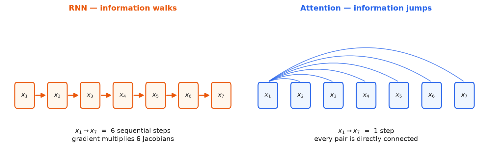

# 2 · Why not RNNs

*~4 min. Lesson 1, part 2 of 7.*

We never build an RNN in this roadmap. Here's the argument for skipping them.

There are two reasons, and people constantly mash them together. **They are different, and one
of them is the real one.**

---

## Reason 1 — path length

How many steps does information take to get from token `i` to token `j`?

**RNN:** it walks. Token 1 reaching token 100 passes through 99 updates.

```
tok1 → tok2 → tok3 → ... → tok100        path length = 99
```

**Attention:** it jumps. Every token sees every token directly.

```
tok1 ─────────────────────→ tok100       path length = 1
```



Why does this matter? Backprop through a path of length `n` multiplies `n` Jacobians together.
If each has typical scale `σ`, the gradient scales like `σⁿ`:

- `σ < 1` → gradient vanishes
- `σ > 1` → gradient explodes
- `σ ≈ 1` → fine, but that's a knife edge

LSTMs exist because of this. The cell state is a near-identity path through time that dodges
the multiplication. It **helps**. It doesn't fix it — the gates still shrink things.

---

## Reason 2 — parallelism (this is the real one)

An RNN processes step `t` only after step `t-1` finishes. That's `O(n)` **sequential** steps
per layer.

This isn't a "buy a bigger GPU" problem. Even in training, where you already know the whole
target sentence, the RNN still has to crawl through it one token at a time.

Attention needs `O(1)` sequential steps. The whole sequence goes through as one batched matmul.

---

## The table everyone quotes (Vaswani, Table 1)

`n` = sequence length, `d` = model dimension:

| Layer | FLOPs per layer | Sequential steps | Max path length |
|---|---|---|---|
| Self-attention | `O(n²·d)` | **`O(1)`** | **`O(1)`** |
| Recurrent | `O(n·d²)` | `O(n)` | `O(n)` |

**Now read the first column carefully. This is a common interview trap.**

Attention is **not cheaper**. Compare `n²d` vs `nd²`:

- `n < d` → attention is cheaper
- `n > d` → **the RNN is cheaper**

With `d = 512`, the crossover is ~512 tokens. Every real context length today is way past it.

So: **attention costs more arithmetic and won anyway**, because that arithmetic runs all at
once. A GPU would much rather do 100× the work in parallel than 1× in series.

If someone asks "why did transformers beat RNNs?" — lead with **parallelism**. Path length is
the second reason, not the first. Saying "attention is more efficient" is just wrong.

---

## The bill for that `n²`

It doesn't go away. We pay it repeatedly:

- KV-cache memory blowing up (Phase 2, Phase 3)
- FlashAttention (lesson 7)
- every long-context trick in Phase 2

**→ [3 · Query, key, value](3-query-key-value.md)**
