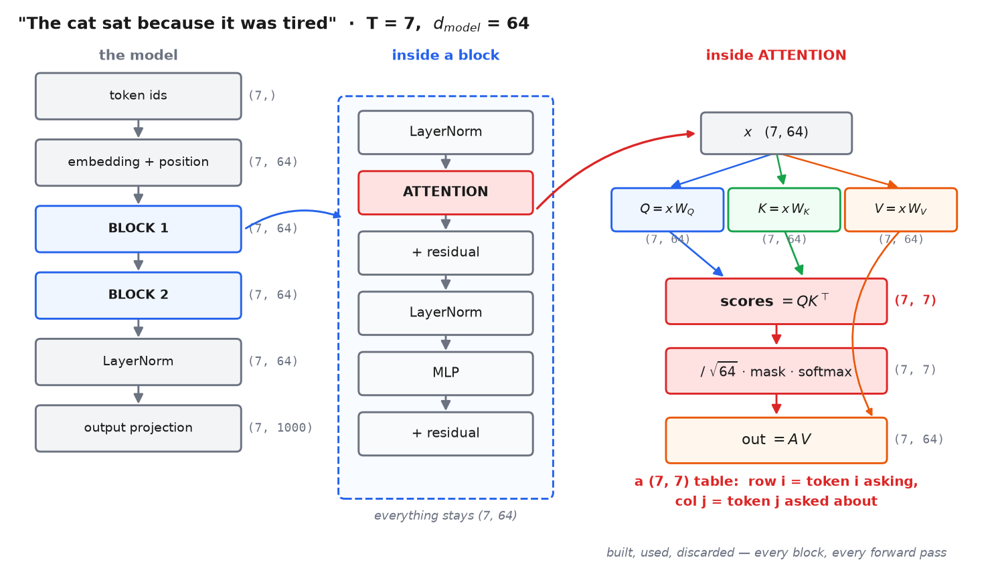

# 3 · The forward pass — where attention actually sits

*~6 min. Lesson 1, part 3 of 8.*

Before any formula: **where does this thing live?**

One concrete model, one concrete sentence, real shapes. Every later part points back here.

---

## First — your sketch, graded

> input `x` of shape `(T_max, vocab_size)` → after encoder `(T_max, feat_num)` → decoder makes
> it `(T_max, vocab_size2)`

**That's right.** Three refinements, all small.

**1. The one-hot is real but nobody materializes it.** `(T, vocab)` one-hot times a
`(vocab, d)` embedding matrix *is* a row lookup. Same math — but at `vocab = 50000` you'd
multiply by a matrix that's 99.998% zeros. So in code:

```python
ids = torch.tensor([42, 891, 17])      # (3,)        token ids, not one-hot
x   = embedding(ids)                   # (3, 64)     straight to features
```

**2. `feat_num` has a name: `d_model`.** The width that stays constant through the whole
stack. 512 in the original transformer, 768 in GPT-2 small, 4096 in a 7B model.

**3. Your `T_max` is about padding.** Batches pad to a common length, so a real tensor is
`(B, T_max, d)`. Back to that at the end.

---

## The running example

Used in every part from here on:

```
sentence   "The cat sat because it was tired"     T = 7 tokens
d_model    64
vocab      1000
blocks     2
```

A GPT-style **decoder-only** model — what you build in lesson 8.

---

## The whole forward pass

```
token ids                        (7,)        [42, 891, 17, 402, 88, 5, 613]
  ↓ embedding lookup
x                                (7, 64)
  ↓ + positional encoding
x                                (7, 64)
  │
  ├────── BLOCK 1 ───────────────────────────────────────┐
  │  LayerNorm                   (7, 64)                 │
  │  ATTENTION                   (7, 64) → (7, 64)       │ ← this whole lesson
  │  x = x + attn_out            (7, 64)   residual      │   happens inside
  │  LayerNorm                   (7, 64)                 │   this one box
  │  MLP                         (7, 64) → (7, 64)       │
  │  x = x + mlp_out             (7, 64)   residual      │
  └──────────────────────────────────────────────────────┘
  │
  ├────── BLOCK 2 ────── same thing again ───────────────┘
  │
  ↓ final LayerNorm
x                                (7, 64)
  ↓ output projection @ (64, 1000)
logits                           (7, 1000)   ← your `(T, vocab_size2)`
```

`(7, 64)` never changes through the stack. That constant width is the **residual stream** —
every block reads from it and adds back into it.

---

## Now zoom into the ATTENTION box

This is the answer to *"where is the score."*

```
input x                          (7, 64)

Q = x @ W_Q      (7, 64) @ (64, 64)  →  (7, 64)     one query per token
K = x @ W_K      (7, 64) @ (64, 64)  →  (7, 64)     one key   per token
V = x @ W_V      (7, 64) @ (64, 64)  →  (7, 64)     one value per token

scores = Q @ K.T (7, 64) @ (64, 7)   →  (7, 7)   ←←← THE SCORES
scores = scores / √64                   (7, 7)
scores = mask(scores)                   (7, 7)      block the future
A = softmax(scores, dim=-1)             (7, 7)      each row sums to 1

out = A @ V      (7, 7)  @ (7, 64)   →  (7, 64)     back to stream width
```

**The score is a `(7, 7)` table.** Row `i` = token `i` asking. Column `j` = token `j` being
asked about. Entry `[i, j]` = how much token `i` wants token `j`.

For our sentence, `scores[4, 1]` is *how much **"it"** attends to **"cat"***.



---

## What happens to the scores afterwards

**Nothing. They're discarded.**

If you were hunting for where scores get stored — they don't. Built, scaled, masked,
softmaxed, multiplied into `V`, gone. Three lines of life.

- Not parameters. Not outputs. A temporary.
- **Rebuilt from scratch every forward pass, in every block.** 2 blocks → that `(7, 7)` matrix
  is created and thrown away twice per forward pass.
- The only things that persist are `W_Q`, `W_K`, `W_V`, `(64, 64)` each. They *produce* scores;
  they aren't scores.

That's also why attention heatmaps are annoying to extract from production code — the fused
kernel never materializes the full matrix at all.

---

## Sizes, so it isn't abstract

| Tensor | Shape | Entries |
|---|---|---|
| `x` — residual stream | `(7, 64)` | 448 |
| `W_Q`, `W_K`, `W_V` each | `(64, 64)` | 4,096 — **learned** |
| **`scores`** | `(7, 7)` | **49 — temporary** |
| `out` | `(7, 64)` | 448 |

Now scale `T`. At 2048 tokens the score matrix is `2048 × 2048` = **4.2 million entries, per
block, per forward pass**. That's the `O(n²)` from part 2, and it's why FlashAttention and the
KV cache exist.

---

## One mechanism, three wirings

Everything above is **self-attention**: `Q`, `K`, `V` all come from the same `x`, so the matrix
is square.

Change only where they come from:

| | Q from | K, V from | Score shape | Mask |
|---|---|---|---|---|
| **Decoder self-attn** — what we build | `x` | `x` | `(T, T)` square | **causal** |
| Encoder self-attn | source | source | `(T_src, T_src)` | padding |
| Cross-attention | target | **source** | `(T_tgt, T_src)` rectangular | padding |

**Cross-attention is why lengths can differ.** 3 English words → 4 French words gives a
`(4, 3)` score matrix: 4 queries, 3 keys. That's the Bahdanau alignment picture from part 1,
and it returns in Phase 9 when image patches attend to a text prompt.

For the rest of this section: **square and causally masked.**

---

## Back to your `T_max`

Real batches pad to a common length, so `x` is `(B, T_max, 64)` and scores are
`(B, T_max, T_max)`. Padding positions are garbage, and without help every real token would
attend to them.

That's the **padding mask** — the same `masked_fill(..., -inf)` machinery as the causal mask,
pointed at different positions.

---

## Sanity check

- Attention lives inside a block, between two LayerNorms, wrapped in a residual
- Scores are `(number of queries, number of keys)` — `(7, 7)` here
- Built and discarded every forward pass; `W_Q`/`W_K`/`W_V` are what's learned
- Self-attention → square. Cross-attention → rectangular. Same operation

**→ [4 · Query, key, value](4-query-key-value.md)**
