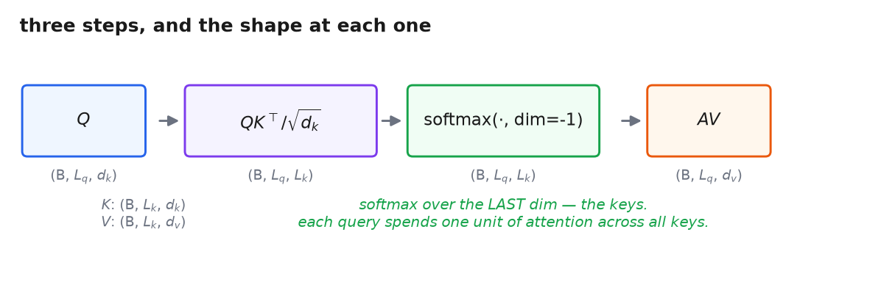
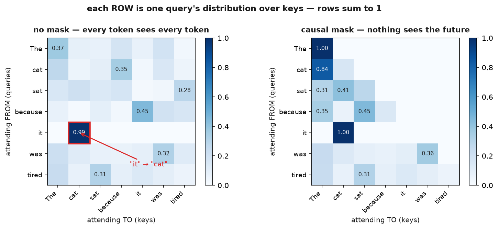

# 5 · The operation

*~4 min. Lesson 1, part 5 of 8.*

Part 1 described scoring as a loop: for each query, score it against every key, one pair at a
time. That's fine for understanding and wrong for running — a Python loop over pairs is the
worst possible shape for a GPU.

So write the whole thing as matrices, and it collapses to one line:

```
Attention(Q, K, V) = softmax( Q Kᵀ / √d_k ) V
```

Nothing new happens here. This is parts 1, 3 and 4 with the loops removed.

---

## It's the same three steps

| Part 1 (one query at a time) | Here (all queries at once) |
|---|---|
| `e_ij = score(s, hⱼ)` for each `j` | `S = Q Kᵀ` — one matmul, whole table |
| `α = softmax(e)` | `A = softmax(S, dim=-1)` |
| `c = Σ αⱼ hⱼ` | `O = A V` — one matmul |

The loop became a matmul. That's the entire difference, and part 1 explained why it matters:
matmul is what the hardware wants.

---

## With our running example

From part 3 — `T = 7`, `d = 64`, single head, self-attention:

```
Q, K, V                (7, 64)  each

S = Q Kᵀ / √64         (7, 64) @ (64, 7)   →  (7, 7)
A = softmax(S, dim=-1) (7, 7)                  rows sum to 1
O = A V                (7, 7)  @ (7, 64)   →  (7, 64)
```

In general, with a batch dimension and heads (lesson 2) bolted on the front:

```
Q: (B, H, L_q, d_k)      B = batch, H = heads
K: (B, H, L_k, d_k)      L = sequence length, d = dimension
V: (B, H, L_k, d_v)
                    →    S, A: (B, H, L_q, L_k)      O: (B, H, L_q, d_v)
```

The leading dimensions just come along for the ride. Your implementation must not assume how
many there are.



---

## `dim=-1`. Not `dim=-2`.

Softmax goes over the **key** dimension.

Each query has one unit of attention to spend and splits it across the keys. That's step 2
from part 1, unchanged: `α` sums to 1 over the candidates.

`dim=-2` makes keys compete against each other across different queries. That quantity has no
meaning, and the rows won't sum to 1.

**And it will not crash.** The loss still goes down a bit. The model is quietly broken. This is
the single most common attention bug — a one-character typo.

---

## What the matrix actually looks like

Real weights for *"The cat sat because it was tired"* — the `(7, 7)` table from part 3, filled
in. `it` finds `cat`:



Every **row** is one query's distribution over the keys, and every row sums to 1. The right
panel adds the causal mask — the upper triangle is exactly zero, so nothing sees the future.

That's what `A` is. Not a metaphor — the actual tensor, mid-forward-pass, before it gets
multiplied into `V` and discarded.

---

## Two shapes that don't have to match

**`L_q` and `L_k` can differ.** Queries from one sequence, keys and values from another — the
cross-attention row from part 3's table. Phase 9 conditions images on text this way.

**`d_k` and `d_v` can differ** too, though in practice everyone sets them equal.

Your implementation shouldn't assume either is square.

---

Next: the one piece of that formula that isn't obvious.

**→ [6 · Why √d](6-why-sqrt-d.md)**
