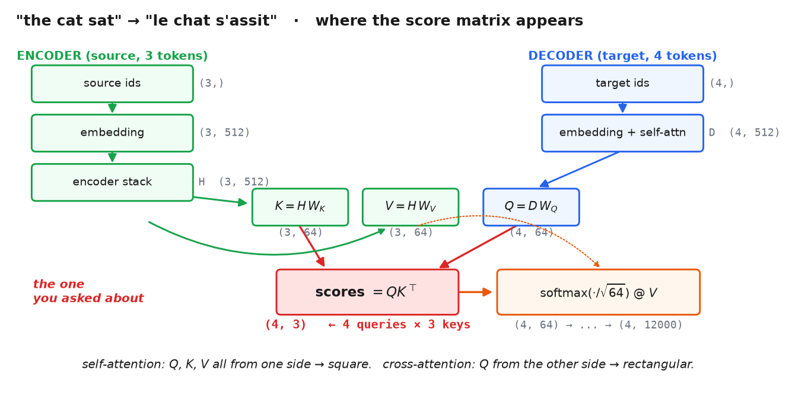

# 5 · Where the scores actually live

*~6 min. Lesson 1, part 5 of 8.*

Formulas in isolation are hard to place. This part traces one sentence through a real model
and points at the exact tensor.

---

## First — your sketch, graded

> input `x` of shape `(T_max, vocab_size)` → after encoder `(T_max, feat_num)` → decoder makes
> it `(T_max, vocab_size2)`

**That's right.** Three refinements, all small.

**1. The one-hot is real but nobody materializes it.** `(T, vocab)` one-hot times a
`(vocab, d)` embedding matrix *is* a row lookup. Same math, so your version isn't wrong — but
with `vocab = 50000` you'd be multiplying by a matrix that's 99.998% zeros. In code:

```python
ids = torch.tensor([15, 892, 447])        # (3,)          token ids, not one-hot
x   = embedding(ids)                      # (3, 512)      straight to features
```

**2. `feat_num` has a name: `d_model`.** It's the width of the residual stream — the number
that stays constant through the whole stack. 512 for the original transformer, 768 for
GPT-2 small, 4096 for a 7B model.

**3. The decoder's length is its own.** Source and target lengths differ — 3 English words
might become 4 French ones. So it's `(T_tgt, vocab_size2)`, not `(T_max, ...)`. **That mismatch
is exactly what makes the score matrix rectangular**, which is the thing you're asking about.

---

## The trace

Translate **"the cat sat"** (3 tokens) into **"le chat s'assit"** (4 tokens).

```
d_model = 512      source vocab = 10000      target vocab = 12000
```

### Encoder side

```
source ids            (3,)          [15, 892, 447]
  ↓ embedding
x                     (3, 512)
  ↓ encoder stack
H                     (3, 512)      ← your "feat_num" — one 512-vector per source word
```

### Decoder side, at the point where it looks back

```
target so far         (4,)
  ↓ embedding + decoder self-attention
D                     (4, 512)
```

Now the cross-attention. **Queries come from the decoder, keys and values from the encoder:**

```
Q = D @ W_Q           (4, 512) @ (512, 64)  →  (4, 64)
K = H @ W_K           (3, 512) @ (512, 64)  →  (3, 64)
V = H @ W_V           (3, 512) @ (512, 64)  →  (3, 64)
```

**Here it is:**

```
scores = Q @ K.T      (4, 64) @ (64, 3)     →  (4, 3)     ← THE SCORES
```

**A `(4, 3)` table. 4 French positions × 3 English words.** Entry `[i, j]` = how much French
position `i` cares about English word `j`.

```
                the    cat    sat
    le    [    2.10   0.31  -0.44 ]
    chat  [    0.12   3.02   0.08 ]
    s'    [   -0.20   0.44   1.71 ]
    assit [    0.05   0.19   2.88 ]
```

Softmax each **row** → each French position spends one unit of attention across the 3 English
words. Then:

```
A      = softmax(scores / √64)    (4, 3)
output = A @ V                    (4, 3) @ (3, 64)  →  (4, 64)
```

And onward to `(4, 512)` → `(4, 12000)` logits. Your last shape, confirmed.



That `(4, 3)` matrix is literally the alignment picture Bahdanau plotted in 2014 — which word
translates to which.

---

## Where does the score go afterwards?

**Nowhere. It's an intermediate.**

If you were looking for where scores get stored, that's the confusion — they don't. They're
built, softmaxed, multiplied into `V`, and thrown away. Not parameters, not outputs. They exist
for three lines.

The only things that persist are `W_Q`, `W_K`, `W_V` — which *produce* scores rather than being
scores.

(This is also why attention heatmaps are annoying to extract from production code: the fused
kernel never even materializes that matrix.)

---

## Three places attention shows up

Same operation every time. Only the source of Q, K, V changes:

| Where | Q from | K, V from | Score shape | Masked? |
|---|---|---|---|---|
| Encoder self-attention | source | source | `(T_src, T_src)` | padding only |
| Decoder self-attention | target | target | `(T_tgt, T_tgt)` | **causal** |
| Decoder cross-attention | target | **source** | `(T_tgt, T_src)` | padding only |

**Self-attention** = Q, K, V from the same place, so the matrix is square.
**Cross-attention** = Q from one place, K/V from another, so it's rectangular.

That's the entire distinction. Not two mechanisms — one mechanism, two wiring diagrams.

---

## What we're actually building

The translation model above is the 2017 encoder–decoder. **We build a decoder-only model**
(GPT-style, lesson 8), which keeps only the middle row:

- no encoder
- no cross-attention
- one causal self-attention per block, score shape `(T, T)`

So for the rest of this section, **the score matrix is square and causally masked**. The
translation example is here because it makes the rectangular case visible, and because
cross-attention comes back in Phase 9 when an image attends to a text prompt — queries from
image patches, keys and values from text.

---

## Your `T_max` instinct was pointing at something real

Batches pad to a common length, so a real tensor is `(B, T_max, d)`. Padding tokens are
garbage, and without intervention every real token would attend to them.

That's the **padding mask** — a second use of the same masking machinery as the causal mask.
Same `masked_fill(..., -inf)` before the same softmax.

---

## Sanity check

- The score matrix is `(number of queries, number of keys)`
- Square in self-attention, rectangular in cross-attention
- It's an intermediate — created, used, discarded. `W_Q`/`W_K`/`W_V` are what's learned
- One mechanism; encoder self / decoder self / cross differ only in where Q, K, V come from

**→ [6 · Why √d](6-why-sqrt-d.md)**
