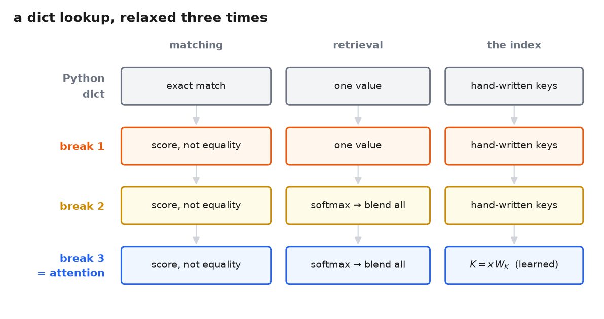
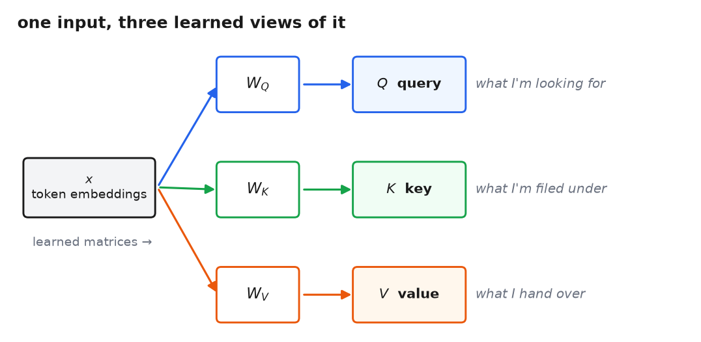
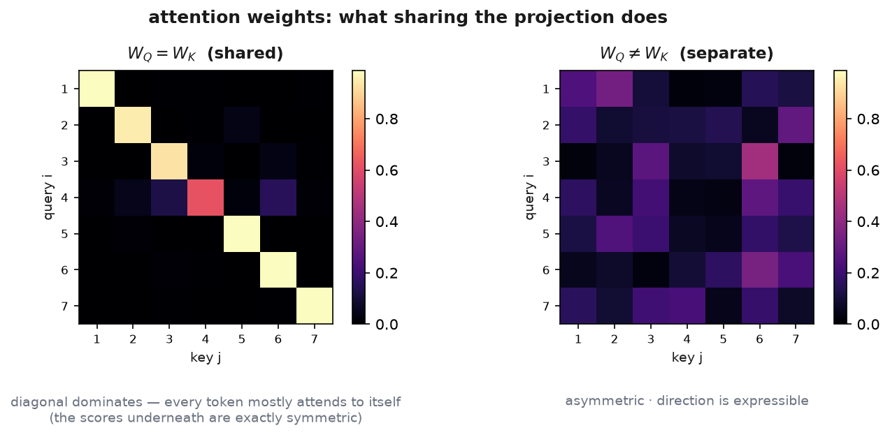

# 6 · Query, key, value

*~6 min. Lesson 1, part 6 of 10.*

## The problem

Part 5 closed on the open question: part 4 conjured three matrices and never justified them. So
try the cheap version. Delete them — let attention read $x$ raw:

$$Q = K = V = x$$

Everything still typechecks: $E = xx^\top$ is $(7, 64)(64, 7) = (7, 7)$, softmax each row, blend —
the whole box runs. And you just saved three $(64, 64)$ matrices, $3 \times 4096 = 12{,}288$
parameters per block. If nothing breaks, part 4 was wasting your memory.

Two things break, and a third job goes undone. To see them, get clear on what the three slots
*do* — via a data structure you use daily.

## A dict, relaxed three times

A Python dict lookup has three roles in play:

```python
d = {"cat": cat_info, "sat": sat_info}
d["cat"]        # a request comes in, matches a label, contents come out
```

- the **request** you look things up with — `"cat"`
- the **labels** entries are filed under — the dict's keys
- the **contents** you get back — the dict's values

Note what the key is *not*: it's not what you receive. What you receive is the value; the key is
only what the entry is filed under. Attention keeps all three roles and relaxes three rigidities:

| | Dict | Attention |
|---|---|---|
| matching | exact: request == key, else `KeyError` | a dot-product **score** — every key matches *somewhat* |
| retrieval | the one winner returns its value | softmax the scores, return a **blend of all values** |
| the index | keys and values written by hand | all three roles **learned**, as projections of $x$ |



The third row is where part 5's question lives. In a dict, request, label, and contents are three
independent pieces of data. In attention they're all derived from the *same* $x$ — so if the
three roles are to say different things, each needs its own learned view. Whether they *need* to
differ is exactly what's about to break:

> **Query** $= xW_Q$ — what this position is looking for.
> **Key** $= xW_K$ — what this position advertises; what it's filed under.
> **Value** $= xW_V$ — what this position hands over once chosen.



Delete the matrices and every position must use one vector for all three jobs. Here is what that
costs.

## Break one: you can only ask for yourself

With $Q = K = x$, look at what a score *is*. Row 5 — "it" — rates key $j$ as $x_5 \cdot x_j$
($x_i$ meaning row $i$ of $x$, one position): similarity to $x_5$. The question "what am I
looking for?" has been hardwired to a single answer — **"things like me."** Attention
degenerates into nearest-neighbor search in embedding space.

But what "it" needs is "cat", and *needing is not resembling*. (Whether a pronoun's vector
happens to resemble its antecedent's is an illustration either way — the lock is the theorem:
with $Q = K$, similar-to-me is the only expressible question.) A single *shared* matrix doesn't
unlock it: $Q = K = xW$ just moves the search into $W$-space — the question is still "things
like my own image." Only *different* maps free the question from the identity: $W_Q$ lets a
position ask for what it lacks, $W_K$ lets it advertise what it is. And direction comes free:
"it"→"cat" can be strong while "cat"→"it" is weak, because $W_Q x_{\text{it}}$ landing near
$W_K x_{\text{cat}}$ says nothing about where $W_Q x_{\text{cat}}$ lands.

(On an *unmasked* op — part 7 draws one — there's also a tidy symmetry argument:
$E = xx^\top$ forces $E_{ij} = E_{ji}$, every relationship mutual. Part 4's causal mask happens
to throw the mirror entry away, so for the model in hand the ask-for-yourself lock is the real
problem; the symmetry version bites wherever both directions are live.)

## Break two: everyone talks to themselves

Now the diagonal of $xx^\top$: $E_{ii} = x_i \cdot x_i = \lVert x_i \rVert^2$, a vector's
squared length. Cauchy–Schwarz says $x_i \cdot x_j \le \lVert x_i\rVert\,\lVert x_j\rVert$ — so
with all rows the same length, nothing outscores the diagonal. And at initialization that's
exactly the situation: part 4's LayerNorm sits immediately before attention and hands every row
the same length (the learned gain hasn't moved yet). So before any learning happens, each
position's largest single weight is its own: **the op starts life biased toward a no-op** — and
"hand me back myself" is a service the residual connection already provides for free.

Separate projections dissolve this too: the diagonal becomes $x_iW_Q \cdot x_iW_K$ — two
*different* views of the same row, with no length argument forcing them to align.



The picture: with a shared projection (left panel), the self-lock shows plainly. One honesty
note — the equal-length theorem was for raw post-LayerNorm $x$; rows of $xW$ needn't keep equal
lengths, so the left panel's dominant diagonal is a random instance of the tendency, not a
theorem. Separate projections (right panel): direction expressible, diagonal ordinary.

## And the value

$W_V$ answers a complaint part 1 already filed: $h_j$ did two jobs, deciding *whether* it gets
picked and being *what you get*. Those pull in different directions. What makes "cat" findable
by "it" — say, noun-ness or animacy; an illustration, not a claim about what a trained model
really keys on — is not what "it" should receive once the match is made, which is "cat"'s
actual content. One vector serving both jobs has to compromise between
them; $W_K$ gets to optimize for being found, $W_V$ for being useful once found.

## Where the names come from

"Query, key, value" is the vocabulary of key-value stores — databases, your dict. The split
predates the transformer: memory-network architectures used "different encodings in the
addressing and output stages of the memory read" a year earlier (Key-Value Memory Networks,
Miller et al., 2016). Name the metaphor, then let it go: in code, each role is one matmul
against $x$.

Two glosses worth un-learning:

- **"The key is what I need."** No — what you need comes back as the *value*. The key is the
  label the match runs against.
- **"Keys come from the encoder."** Only in part 1's translator, where the two sides happened to
  be different networks. Key means *the side being looked at*, wherever both sides come from —
  part 4's are the same seven rows. (The rectangular case returns, with its proper name, in
  part 7.)

---

```
Q = K = V = x — cheaper, runs, and:
    the query is the position itself  → only question: "like me?"   → W_Q ≠ W_K
    diagonal = ‖x_i‖², the row max    → op starts as a no-op        → separate views unlock it
    advertise = deliver               → matching signal ≠ payload   → W_V frees the payload
```

Three roles, three learned views, 12,288 parameters per block — the price of asymmetry. What's
still hardwired is the *shape* of the op: part 4 forced queries and keys to be the same seven
rows. Part 1's translator was never like that.

**→ [7 · The operation, generalized](7-the-operation.md)**
