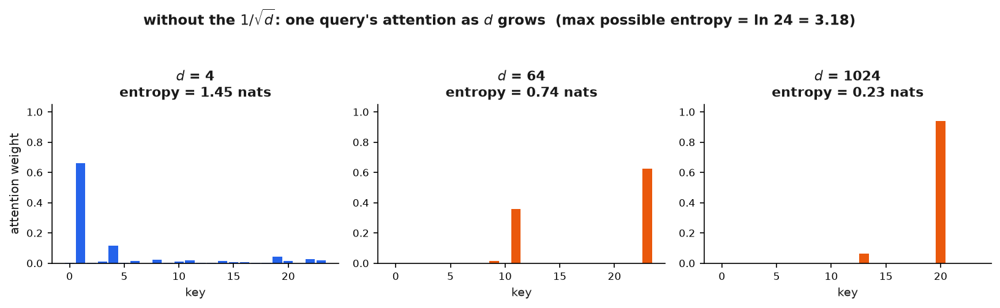
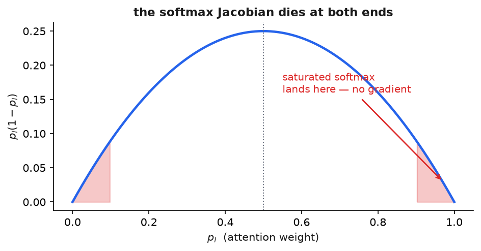

# 6 · Why √d

*~6 min — the one to actually slow down for. Lesson 1, part 6 of 8.*

This is the whiteboard question. Interviewers love it because the derivation is short and you
either followed it or you memorized it.

---

## Setup

One query `q` and one key `k`, both vectors of length `d`.

Assume their components are independent, mean 0, variance 1. (Roughly true at init. We'll come
back to how false it gets later.)

---

## Step 1 — the mean is 0

```
q · k = Σᵢ qᵢkᵢ

E[q·k] = Σᵢ E[qᵢ]E[kᵢ] = 0
```

Nothing surprising.

---

## Step 2 — the variance is d

Terms are independent, so variances add:

```
Var(q·k) = Σᵢ Var(qᵢkᵢ)
```

One term, using `Var(X) = E[X²] − E[X]²`:

```
Var(qᵢkᵢ) = E[qᵢ²kᵢ²] − 0
          = E[qᵢ²] · E[kᵢ²]         (independent)
          = 1 · 1 = 1               (mean 0, so E[X²] = Var(X))
```

Sum over `d` of them:

```
Var(q·k) = d          std(q·k) = √d
```

**There it is.** The scores going into softmax have standard deviation `√d`. Bigger head → bigger
scores. Automatically.

---

## Step 3 — why big scores are bad

With `d = 64`, scores land around ±8. And `e⁸ ≈ 3000`, so softmax comes out essentially
one-hot: one key gets ~1.0, everything else ~0.



You might think "great, confident attention." No. Look at the gradient.

Softmax Jacobian:

```
∂pᵢ/∂zⱼ = pᵢ(δᵢⱼ − pⱼ)
```

Now plug in a one-hot `p` (say `p_m ≈ 1`, everything else `≈ 0`):

| case | value | → |
|---|---|---|
| `i ≠ m` | `pᵢ(...)` where `pᵢ ≈ 0` | **0** |
| `i = m, j = m` | `p_m(1 − p_m) ≈ 1 × 0` | **0** |
| `i = m, j ≠ m` | `p_m(0 − pⱼ) ≈ −pⱼ` | **0** |

**Every entry is 0.** The Jacobian vanishes.



No gradient reaches `W_Q` and `W_K`. The model cannot learn *where to look*, because the
derivative of "where to look" is zero.

And this happens **at initialization** — when attention is random and being wrong should be
the most useful signal there is. The network starts out confidently arbitrary and can't
correct itself.

---

## Step 4 — divide by the standard deviation

`std = √d`, so dividing by `√d` gives variance 1. Every time. Any `d`.

Two wins:

1. Softmax stays in the range where it has gradients.
2. Behaviour stops depending on `d` — so widening heads doesn't secretly change the
   temperature of every attention distribution in the network.

**Why not divide by `d`?** Because `d` is the *variance*, `√d` is the *standard deviation*.
Dividing by `d` overshoots: scores shrink toward 0, softmax goes uniform, attention attends
everywhere equally. Gradients survive but selectivity dies. You'll see both failures side by
side in the ablation.

---

## It's `√d_head`, not `√d_model`

Very common slip.

With `d_model = 512` and `8` heads: `d_k = 64`, so you divide by `√64 = 8`. **Not `√512`.**

The derivation says why — the dot product happens inside *one head*, over `d_k` components.
`d_model` never shows up anywhere in it.

Get this wrong and you over-shrink by `√H`, pushing attention toward uniform.

---

## What √d does NOT fix

The "variance 1" assumption is true at init. **It is not true later.**

Nothing stops `W_Q` and `W_K` from growing during training — and in big models, they do.
Attention logits creep up over the course of a run and the softmax saturates anyway. Same
failure, different route.

So the honest version:

> **`√d` fixes the scale at initialization, not the whole training trajectory.**

That's why **QK-norm** exists (Phase 2) — normalize `q` and `k` themselves, so the scale is
controlled the entire time. Gemma 2's logit soft-capping attacks the same drift.

Saying this in an interview is the difference between having read the paper and having trained
something.

---

Also worth knowing: Vaswani's footnote 4 says they *hypothesized* saturation was the cause. It
was a reasoned guess that worked, not a proof. It held up.

**→ [7 · The PyTorch you need](7-pytorch-you-need.md)**
